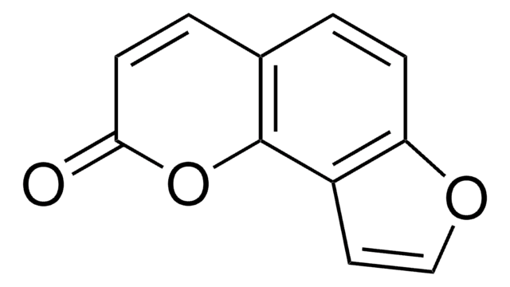
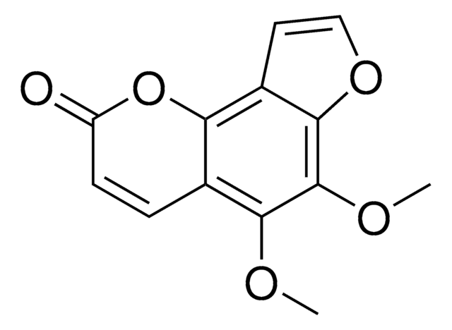
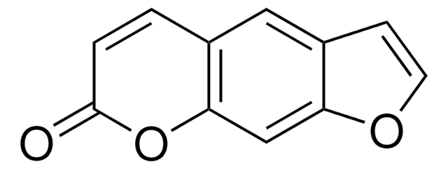
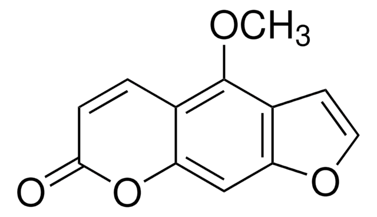
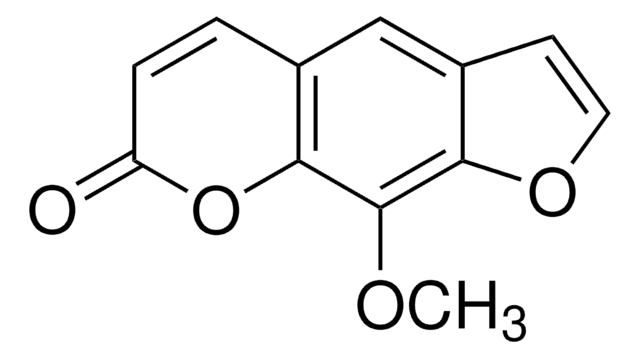
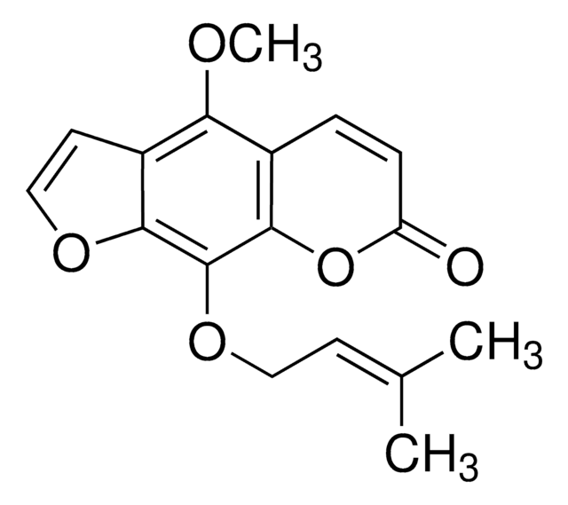
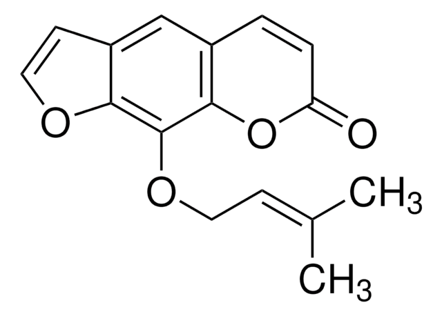

# [Основная доска проекта](../README.md)

## Свойства

Свойства получены методом [PASS](https://way2drug.com/PassOnline) (Prediction of Activity Spectra for Substances) *Pa>0.7 и Pi < 0.5*

| Свойства                           | Псорален | Метоксален | Ангелецин | Бергаптен | Фел-лоптерин | Императорин | пимпи-неллин |
| ---------------------------------- | -------- | ---------- | --------- | --------- | ------------ | ----------- | ------------ |
| структура                          | линейная | линейная   | угловая   | линейная  | линейная     | линейная    | угловая      |
| Радиопротектор                     | +        | -          | -         | -         | +            | +           | -            |
| Ингибитор инсулина             | +        | -          | -         | +         | -            | -           | -            |
| Фотосенсибилизатор                 | +        | +          | +         | +         | +            | +           | +            |
| Антимутагенные                     | +        | +          | +         | -         | +            | +           | +            |
| Агонист апоптоза               | -        | +          | -         | -         | +            | -           | +            |
| Спазмолитик                        | -        | +          | +         | +         | +            | +           | +            |
| Ингибитор киназы гистидина | -        | -          | +         | -         | -            | -           | -            |
| Ингибитор оксидоредуктазы          | +        | -          | +         | +         | +            | +           | +            |
| Антипаразитарное                   | -        | -          | -         | -         | +            | +           | -            |

#### Вдобавок каждый представитель является субстратом/ингибитором для нескольких ферментов из семейства P450

 

## Особенности структуры

#### Условно представителей можно разделить на 3 подгруппы: ___угловые(2)___, ___"легкие" модификации псоралена(3)___, ___Пренильные модификации псоралена(2)___.

## угловые

### ангелицин

Является базовым представителем угловых фуранокумаринов

### пимпинеллин

Двузамещенный ангелицин

## "легкие" модификации псоралена

### псорален

Является базовым представителем линейных фуранокумаринов

### Бергаптен

Однозамещенный псорален

### Метоксален

Однозамещенный псорален, изомер бергаптена

## Пренильные модификации псоралена

### Феллоптерин

Двузамещенный псорален с пренильной группой

### Императорин

Однозамещенный псорален с пренильной группой

---